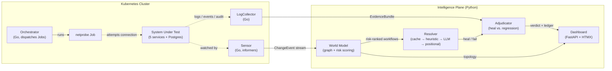

# Ariadne

**Autonomous Quality Engineering for the AI Development Era** — built for
Amadeus's hackathon star problem: *how do we reinvent QA when software itself
is increasingly written and modified by AI?*

[](https://github.com/ChiragVenkateshaiah/ariadne/actions/workflows/ci.yml)
[](LICENSE)


> **📹 Demo video:** _(link goes here once recorded)_

---

## The claim this whole project is built to test

Every other self-healing QA demo does the same trick: an LLM reads the DOM
and rewrites a broken selector. That demo has a fatal flaw worth attacking
directly:

> **Naive self-healing is a liability.** A test that heals itself around a
> real regression has converted a caught bug into an escaped one.

Deciding whether a failing test is a **broken test** or a **broken
application** needs evidence the test runner doesn't have. That evidence
lives in the cluster — pod logs, Kubernetes events, the API-server audit
log, and the deployment history. Ariadne is what happens when you put a QA
system *inside* Kubernetes instead of pointing one at it from outside.

## What it actually does

- **Watches the cluster**, not the commit log. A ConfigMap edit can silently
  change business behavior with zero image change — commit-triggered CI
  never sees it; Ariadne's Sensor does, in real time.
- **Builds a business-workflow graph** automatically from real topology
  (Kubernetes objects, service-to-service calls, API/UI surfaces) — nobody
  hand-writes a test plan.
- **Selects tests by risk, not by running everything.** A change maps to a
  graph node; reverse traversal finds every workflow that transitively
  depends on it, ranked by a documented, explainable weighted score — not
  an LLM guess.
- **Heals tests structurally.** Tests are stored as *intent*
  ("enter the origin airport"), never as brittle selectors. A Resolver
  re-binds intent to the live DOM through four tiers — cache, semantic
  heuristics, an LLM fallback, and a positional last resort — so selector
  drift costs one cheap re-resolve, not a rewrite.
- **Refuses to heal a real bug.** The Adjudicator sorts every failure into
  `TEST_DEFECT` / `INTENT_DRIFT` / `APP_REGRESSION` / `ENV_FLAKE` /
  `UNDETERMINED`, with an invariant enforced *in code*: a heal can never be
  persisted against an `APP_REGRESSION` verdict.
- **Proves network segmentation instead of asserting it.** NetworkPolicies
  are generated mechanically from the graph's real service-call edges —
  zero hand-written rules — then a Kubernetes Job dispatched with the exact
  labels of a real service *attempts the connection* to prove the policy
  actually holds.
- **Finds least-privilege violations from real behavior**, not static RBAC
  review: the API-server audit log shows exactly what a ServiceAccount
  *does*, not just what it's *allowed* to do.

## Architecture



**The split: Go does everything that talks to Kubernetes; Python does
everything that thinks.** Not a performance argument — the latency budget
is dominated by LLM calls — but correctness at the K8s API layer (informer
caches, workqueues, leader-election-ready) and the two jobs Go is
genuinely better at: concurrent log fan-out, and a 5MB static binary that
can be injected as any service's identity for network testing.

Full design rationale, every gotcha paid for in advance, and the complete
build order live in **[docs/ARCHITECTURE.md](docs/ARCHITECTURE.md)**.

## Status

Built end-to-end and **verified live against a real kind cluster** at every
stage — not mocked, not simulated. Highlights:

| Component | Status |
|---|---|
| Cluster Sensor (Go, in-cluster, RBAC-scoped) | ✅ both demo triggers proven live |
| World Model (topology + LLM workflow synthesis + risk ranking) | ✅ a real ConfigMap change traverses 9 real graph hops to the correct workflows, correctly ranked |
| Self-healing Resolver + UI runner | ✅ real two-run heal demo: 7/11 steps healed across all three resolution tiers |
| Evidence Correlator (LogCollector) | ✅ pod logs, K8s events, audit log fan-out, zero collection errors |
| Adjudicator | ✅ heal-vs-block invariant enforced and tested |
| Network conformance (Orchestrator + netprobe + generated NetworkPolicies) | ✅ real Job dispatch proves `web-ui→search-api` allowed, `web-ui→postgres` blocked |
| Dashboard | ✅ live topology graph, change feed, heal/block ledger, all polling in real time |
| Tests + CI | ✅ 29 Go tests + 27 Python tests, GitHub Actions green on every push |

See [docs/ARCHITECTURE.md](docs/ARCHITECTURE.md) for Phase 2 (deeper API/
networking work, Prometheus + Grafana) and Phase 3 (production deployment
story, CI, the differentiators specifically relevant to Amadeus's domain).

## Quickstart

```bash
# 1. Toolchain (Go, kubectl, kind, buf, helm)
./scripts/bootstrap-toolchain.sh

# 2. Cluster: kind + Calico (NetworkPolicy enforcement verified live, not assumed)
./scripts/create-cluster.sh
./scripts/install-calico.sh

# 3. Build and deploy the demo application (5 services + Postgres)
./scripts/build-and-load-sut.sh
./scripts/deploy-sut.sh

# 4. Build and deploy Ariadne's own control plane
./scripts/build-and-load-control-plane.sh
./scripts/deploy-control-plane.sh

# 5. Open the app
open http://localhost:8080
```

The Python brain (world-model ingestion, resolver, adjudicator, dashboard)
lives in `brain/` — see `brain/README.md` for its one packaging gotcha
(a PEP 420 namespace package merging hand-written and generated code) and
setup steps.

## Repository layout

```
proto/            frozen gRPC contract between the two planes
control-plane/    Go: sensor, logcollector, orchestrator, netprobe, the SUT
brain/            Python: world model, resolver, adjudicator, dashboard
sut/              the demo application (flight search & booking)
deploy/           Kubernetes manifests, generated NetworkPolicies
docs/             architecture, full build order, Phase 2/3 plans
.github/workflows/ CI: proto lint/breaking, Go, Python, Docker builds
```

## Why a flight-booking app

Not incidental. The system under test is a travel-tech booking flow on
purpose — the exact business domain this hackathon's host would recognize
immediately, exercised the same way a real airline or travel platform's
QA org would need it exercised.

## License

[Apache 2.0](LICENSE)
